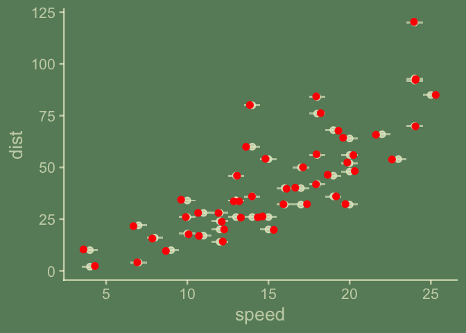
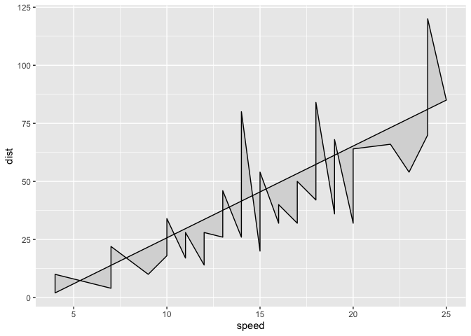
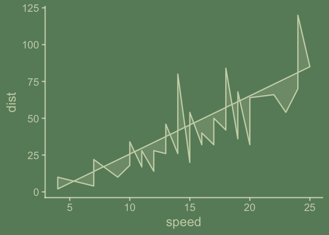
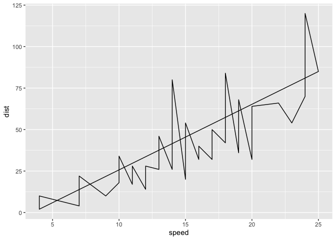
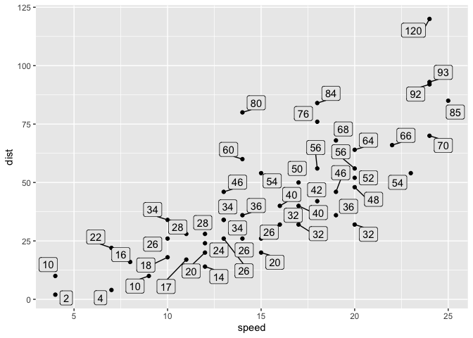

<!-- README.md is generated from README.Rmd. Please edit that file -->

# ggex

<!-- badges: start -->
<!-- badges: end -->

ggex (think ‘FedEx’) is for ‘ex’ as in fast and expressive and ‘ex’ for
extension/extenders.

## `qlayer()`, is `layer()` with plenty of defaults

``` r
qlayer <- function (mapping = NULL, data = NULL, geom = ggplot2::GeomPoint, 
                    stat = ggplot2::StatIdentity, 
    position = position_identity(), ..., na.rm = FALSE, show.legend = NA, 
    inherit.aes = TRUE) 
{
    ggplot2::layer(data = data, mapping = mapping, geom = geom, 
        stat = stat, position = position, show.legend = show.legend, 
        inherit.aes = inherit.aes, params = rlang::list2(na.rm = na.rm, 
            ...))
}
```

``` r
library(ggplot2)
ggplot(data = cars) + 
  aes(speed, dist) + 
  qlayer()
```

<!-- -->

``` r

last_plot() + 
  qlayer(geom = GeomTile)
```

<!-- -->

``` r

last_plot() + 
  qlayer(position = "jitter", color = "red")
```

<!-- -->

``` r

last_plot() + 
  ggchalkboard::theme_chalkboard()
```

<!-- -->

## `combine_aes()` to make small adjustments to exising `default_aes` settings

``` r
combine_aes <- utils::modifyList
```

``` r
GeomPoint$default_aes
#> Aesthetic mapping: 
#> * `shape`  -> `from_theme(pointshape)`
#> * `colour` -> `from_theme(ink)`
#> * `size`   -> `from_theme(pointsize)`
#> * `fill`   -> NA
#> * `alpha`  -> NA
#> * `stroke` -> `from_theme(borderwidth)`

combine_aes(GeomPoint$default_aes, aes(color = "blue"))
#> Aesthetic mapping: 
#> * `shape`  -> `from_theme(pointshape)`
#> * `colour` -> "blue"
#> * `size`   -> `from_theme(pointsize)`
#> * `fill`   -> NA
#> * `alpha`  -> NA
#> * `stroke` -> `from_theme(borderwidth)`


GeomBluePoint <- ggproto("GeomBluePoint", 
                         GeomPoint, 
                         default_aes = 
                           combine_aes(GeomPoint$default_aes, 
                                       aes(color = "blue")))

ggplot(cars) + 
  aes(speed, dist) + 
  stat_identity(geom = GeomBluePoint)
```

<!-- -->

### `combine_aes()` examples containing recommended usage for new geom theming… use `from_theme()`, `col_mix()`, `paper`, `ink`, `accent` etc.

#### GeomBubble, GeomBubbleColorMix, GeomPointAccentColor

``` r
GeomPoint$default_aes
#> Aesthetic mapping: 
#> * `shape`  -> `from_theme(pointshape)`
#> * `colour` -> `from_theme(ink)`
#> * `size`   -> `from_theme(pointsize)`
#> * `fill`   -> NA
#> * `alpha`  -> NA
#> * `stroke` -> `from_theme(borderwidth)`

GeomBubble <- ggproto("GeomBubble", 
                      GeomPoint, 
                      default_aes = combine_aes(GeomPoint$default_aes, 
                                                aes(shape = 21,
                                                    size = from_theme(pointsize*4))))

GeomBubble$default_aes
#> Aesthetic mapping: 
#> * `shape`  -> 21
#> * `colour` -> `from_theme(ink)`
#> * `size`   -> `from_theme(pointsize * 4)`
#> * `fill`   -> NA
#> * `alpha`  -> NA
#> * `stroke` -> `from_theme(borderwidth)`

ggplot(cars) + 
  aes(speed, dist) + 
  qlayer(geom = GeomBubble)
```

<!-- -->

``` r

aes_new_bubble_colmix <- aes(shape = 21,
                             size = from_theme(pointsize*4),
                             fill = from_theme(ggplot2:::col_mix(ink, paper, 0.35)))

GeomBubbleColorMix <- ggproto("GeomBubbleColorMix", 
                              GeomPoint, 
                              default_aes = combine_aes(GeomPoint$default_aes,
                                                        aes_new_bubble_colmix))

ggplot(cars) + 
  aes(speed, dist) + 
  qlayer(geom = GeomBubbleColorMix)
```

<!-- -->

``` r

GeomPointAccentColor <- ggproto("GeomPointAccentColor",  
                                GeomPoint,
                                default_aes = combine_aes(GeomPoint$default_aes,
                                                          aes(color = from_theme(accent))))

ggplot(cars) + 
  aes(speed, dist) + 
  qlayer(geom = GeomPointAccentColor, size = 6, alpha = .5) + 
  geom_smooth()
#> `geom_smooth()` using method = 'loess' and formula = 'y ~ x'
```

<!-- -->

``` r

last_plot() + 
  ggchalkboard::theme_chalkboard()
#> `geom_smooth()` using method = 'loess' and formula = 'y ~ x'
```

<!-- -->

#### GeomPolygonWithOutline, GeomPolygonOutline

``` r
GeomPolygonWithOutline <- ggproto("GeomPolygonWithOutline", 
                                  GeomPolygon,
                                  default_aes = combine_aes(GeomPolygon$default_aes,
                                                            aes(color = from_theme(ink),
                                                                fill = from_theme(ggplot2:::col_mix(ink, paper, 0.85)))))
  
GeomPolygonOutline <- ggproto("GeomPolygonOutline",  # New Geom
                              GeomPolygon, # inherit
                              default_aes = combine_aes(GeomPolygon$default_aes,
                                                        aes(color = from_theme(ink),
                                                            fill = NA)))

ggplot(cars) + 
  aes(speed, dist) + 
  qlayer(geom = GeomPolygonWithOutline)
```

<!-- -->

``` r

last_plot() + 
  ggchalkboard::theme_chalkboard()
```

<!-- -->

``` r

ggplot(cars) + 
  aes(speed, dist) + 
  qlayer(geom = GeomPolygonOutline)
```

<!-- -->

``` r

last_plot() + 
  ggchalkboard::theme_chalkboard()
```

<!-- -->

#### GeomLabelClearBackground, GeomLabelWithPanelBackground, GeomLabelWithPanelBackground

``` r
GeomLabelClearBackground <- ggproto("GeomLabelClearBackground",
                                    GeomLabel,
                                    default_aes = 
                                      combine_aes(GeomLabel$default_aes, 
                                                  aes(fill = NA, linewidth = 0)))

ggplot(cars) + 
  aes(speed, dist, label = dist) +
  geom_point() +
  qlayer(geom = GeomLabelClearBackground, 
         vjust = "outward",
         hjust = "outward")
```

<!-- -->

``` r

last_plot() + 
  ggchalkboard::theme_chalkboard()
```

<!-- -->

``` r


# I'm pretty sure this isn't right, and maybe 'right' is not possible, but I like the idea of it.
GeomLabelWithPanelBackground <- ggproto("GeomLabelWithPanelBackground",
                                    GeomLabel,
                                    default_aes = 
                                      combine_aes(GeomLabel$default_aes, 
                                                  aes(fill =
                                                        from_theme(ggplot2:::col_mix(ink, paper, .92)),
                                                      linewidth = 0)))
                                    
ggplot(cars) + 
  aes(speed, dist, label = dist) +
  geom_point() +
  qlayer(geom = GeomLabelWithPanelBackground, 
         vjust = "outward",
         hjust = "outward"
         )
```

<!-- -->

``` r


# also not 100% sure what's going on here - why does label outline not disappear?
GeomLabelRepelWithPanelBackground <- ggproto("GeomLabelRepelWithPanelBackground",
                                    ggrepel::GeomLabelRepel,
                                    default_aes = 
                                      combine_aes(ggrepel::GeomLabelRepel$default_aes, 
                                                  aes(fill =
                                                        from_theme(ggplot2:::col_mix(ink, paper, .92)),
                                                      label.size = 0,
                                                      linewidth = 0)))


ggplot(cars) + 
  aes(speed, dist, label = dist) +
  geom_point() +
  qlayer(geom = GeomLabelRepelWithPanelBackground)
```

<!-- -->

## `qproto_update()` lets you use an existing proto object, minimally modified, in a layer(), qlayer(), geom\_\*() or stat\_\*() function.

``` r
proto_update <- function (`_class`, `_inherit`, default_aes_update = NULL, ...) {
    if (!is.null(default_aes_update)) {
        
      new_default_aes <- combine_aes(`_inherit`$default_aes, default_aes_update)
      
    } else {
      
      new_default_aes <- `_inherit`$default_aes
      
    }
  
    ggplot2::ggproto(`_class` = `_class`, 
                     `_inherit` = `_inherit`,
                     default_aes = new_default_aes, ...)
}


qproto_update <- function (`_inherit`, default_aes_update = NULL, ...){
    proto_update("protoTemp", `_inherit`, default_aes_update = default_aes_update, 
        ...)
}
```

``` r
ggplot(cars) + 
  aes(speed, dist) + 
  qlayer(geom = qproto_update(GeomPoint, aes(shape = 21)), # try on geom w modified default aes
         size = 8)
```

<!-- -->

## The `qstat()` family lets you try out Stats without naming them.

``` r
qstat <- function (compute_group = ggplot2::Stat$compute_group, ...) {
    ggplot2::ggproto("StatTemp", Stat, compute_group = compute_group, 
        ...)
}
```

``` r
compute_group_mean <- function(data, scales){
  
  data |> dplyr::summarise(x = mean(x), y = mean(y))
  
}

ggplot(cars) + 
  aes(speed, dist) + 
  geom_point() +
  qlayer(geom = qproto_update(GeomPoint, 
                              aes(size = from_theme(pointsize * 3))),
             stat = qstat(compute_group_mean))
```

<!-- -->

``` r

last_plot() + 
  ggchalkboard::theme_chalkboard()
```

<!-- -->

``` r
qstat_group <- qstat

qstat_layer <- function (compute_layer, ...){
    ggplot2::ggproto("StatTemp", Stat, compute_layer = compute_layer, 
        ...)
}

qstat_panel <- function (compute_panel, ...){
    ggplot2::ggproto("StatTemp", Stat, compute_panel = compute_panel, 
        ...)
}
```

## `vars_pack()` and `vars_unpack()` allow for multi-var aesthetic mapping.

June wrote this…

<https://github.com/ggplot2-extenders/ggplot-extension-club/discussions/18#discussioncomment-10219152>

> The major challenge here is that you’d want a single column to
> represent values across all of the predictors, so you’d need to do
> some kind of compression of values to make them fit inside a single
> column in the layer data. At least for PCA the predictors are of the
> same type, so you could make predictors a list-column of length-3
> numeric vectors.

> I edited your code a bit, introducing the nesting-unnesting functions
> vars_pack() and vars_unpack(). Essentially, the predictor columns are
> nested into a single column and lays dormant until you need it for
> PCA, at which point it’s unnested back into a dataframe. Also note
> that remove_missing() should happen after the unnesting to spot
> individual NA values.

``` r
library(tidyverse)
#> ── Attaching core tidyverse packages ──────────────────────── tidyverse 2.0.0 ──
#> ✔ dplyr     1.1.4     ✔ readr     2.1.5
#> ✔ forcats   1.0.0     ✔ stringr   1.5.1
#> ✔ lubridate 1.9.3     ✔ tibble    3.2.1
#> ✔ purrr     1.0.2     ✔ tidyr     1.3.1
#> ── Conflicts ────────────────────────────────────────── tidyverse_conflicts() ──
#> ✖ dplyr::filter() masks stats::filter()
#> ✖ dplyr::lag()    masks stats::lag()
#> ℹ Use the conflicted package (<http://conflicted.r-lib.org/>) to force all conflicts to become errors

vars_pack <- function(...) {
  
  varnames <- as.character(ensyms(...))
  vars <- list(...)
  listvec <- asplit(do.call(cbind, vars), 1)
  structure(listvec, varnames = varnames)

  }

vars_unpack <- function(x) {
  pca_vars <- x
  df <- do.call(rbind, pca_vars)
  colnames(df) <- attr(pca_vars, "varnames")
  as.data.frame(df)
  
}
```

``` r
palmerpenguins::penguins %>% 
  mutate(outcome = species, 
         predictors = vars_pack(bill_length_mm, bill_depth_mm, flipper_length_mm)) %>% 
    select(outcome, predictors) ->
data

head(data$predictors)
#> [[1]]
#> [1]  39.1  18.7 181.0
#> 
#> [[2]]
#> [1]  39.5  17.4 186.0
#> 
#> [[3]]
#> [1]  40.3  18.0 195.0
#> 
#> [[4]]
#> [1] NA NA NA
#> 
#> [[5]]
#> [1]  36.7  19.3 193.0
#> 
#> [[6]]
#> [1]  39.3  20.6 190.0


data %>%
    mutate(vars_unpack(predictors)) %>% 
  select(-predictors) ->
data


compute_lm_multi <- function(data, scales){
  
  data %>% 
    remove_missing() %>% 
    select(x,y, predictors) %>% 
    mutate(vars_unpack(predictors)) %>% 
    select(-predictors) ->
  data
  
  lm <- lm(data = data, formula = y ~ .)
  
  data$yend = data$y
  data$y = lm$fitted.values
  data$xend = data$x

  data$residuals <- lm$residuals
  
  data
}

pvars <- vars_pack

palmerpenguins::penguins %>% 
  remove_missing() %>% 
  mutate(x = bill_length_mm, y = bill_depth_mm, predictors = pvars(sex, species)) %>% 
  select(x, y, predictors) %>% 
  compute_lm_multi()
#> Warning: Removed 11 rows containing missing values or values outside the scale
#> range.
#> # A tibble: 333 × 7
#>        x     y   sex species  yend  xend residuals
#>    <dbl> <dbl> <int>   <int> <dbl> <dbl>     <dbl>
#>  1  39.1  18.9     2       1  18.7  39.1    -0.232
#>  2  39.5  18.2     1       1  17.4  39.5    -0.799
#>  3  40.3  18.3     1       1  18    40.3    -0.349
#>  4  36.7  17.7     1       1  19.3  36.7     1.63 
#>  5  39.3  19.0     2       1  20.6  39.3     1.63 
#>  6  38.9  18.1     1       1  17.8  38.9    -0.286
#>  7  39.2  19.0     2       1  19.6  39.2     0.649
#>  8  41.1  18.5     1       1  17.6  41.1    -0.899
#>  9  38.6  18.8     2       1  21.2  38.6     2.36 
#> 10  34.6  18.1     2       1  21.1  34.6     3.01 
#> # ℹ 323 more rows

StatLmMulti <- ggproto("StatLmMulti",
                       Stat,
                       compute_panel = compute_lm_multi)

 
palmerpenguins::penguins |>
  remove_missing() |>
  ggplot() + 
  aes(y = flipper_length_mm, x = bill_length_mm, predictors = pvars(species)) + 
  geom_point() + 
  qlayer(stat = StatLmMulti, 
         geom = qproto_update(GeomPoint, 
                              aes(color = from_theme(accent)))) + 
  qlayer(stat = StatLmMulti, 
         geom = qproto_update(GeomSegment,
                              aes(color = from_theme(accent))),
         linetype = "dotted")
#> Warning: Removed 11 rows containing missing values or values outside the scale
#> range.
```

<!-- -->

``` r


last_plot() + 
  geom_smooth(color = "red", method = lm) + 
  aes(group = species)
#> `geom_smooth()` using formula = 'y ~ x'
```

<!-- -->

``` r


last_plot() + 
  ggchalkboard::theme_chalkboard()
#> `geom_smooth()` using formula = 'y ~ x'
```

<!-- -->

------------------------------------------------------------------------

``` r

# seems like the greys might be switched out with ink and paper? Though maybe not...
# from https://github.com/teunbrand/ggplot_tricks
contrast <- function(colour) {
  out   <- rep("grey20", length(colour))
  light <- farver::get_channel(colour, "l", space = "hcl")
  out[light < 50] <- "grey80"
  out
}

# from https://github.com/teunbrand/ggplot_tricks
aes_autocontrast <- aes(colour = after_scale(contrast(fill)))

tidy_titanic <- Titanic |> data.frame() |> tidyr::uncount(Freq)
tidy_titanic |> head()
#>   Class  Sex   Age Survived
#> 1   3rd Male Child       No
#> 2   3rd Male Child       No
#> 3   3rd Male Child       No
#> 4   3rd Male Child       No
#> 5   3rd Male Child       No
#> 6   3rd Male Child       No

ggplot(tidy_titanic) + 
  aes(Sex, Survived) + 
  # sketch of geom_heat
  qlayer(geom = GeomTile,
         stat = qproto_update(StatSum, 
                              aes(fill = after_stat(n),
                                  size = NULL))) + 
  # sketch of geom_heat_text
  qlayer(geom = qproto_update(GeomText, aes_autocontrast),
         stat = qproto_update(StatSum,
                              aes(label = after_stat(n),
                                  fill = after_stat(n),
                                  size = NULL,
                                  )))
```

<!-- -->

``` r

last_plot() + 
  ggchalkboard::theme_chalkboard()
```

<!-- -->
